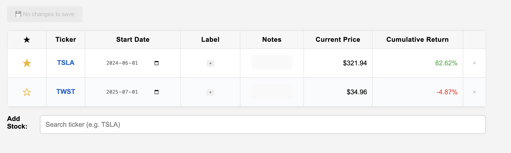

# Todo 
- 5 star system
- add image
- improve date view
- discovery date instead of start date
- 3 month trailing return

# Stock Tracker




A full HTML/JavaScript stock tracker that allows you to search Yahoo Finance stocks and manage your portfolio with date-based cumulative return calculations, customizable labels for filtering, personal notes for each stock, clickable tickers that open Yahoo Finance, GitHub integration for portfolio persistence

## How to use
1. **Fork** this repo
2. Activate **github pages** deployment from github actions in the repo settings

## Local testing

```
npx live-server src --port=8080 
```
