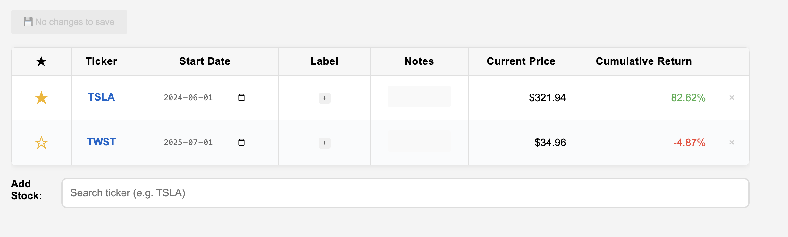

# Stock Tracker



A full HTML/JavaScript stock tracker that uses Yahoo Finance for price lookups. Manage your portfolio with date-based cumulative return calculations, customizable labels for filtering, personal notes for each stock, clickable tickers that open TradingView charts, and GitHub integration for portfolio persistence.

## How to use
1. **Fork** this repo
2. Activate **GitHub Pages** deployment from GitHub Actions in the repo settings (the workflow deploys every branch: `main` to `/`, other branches to `/{branch}`)
3. Use the GitHub tile in the top-right of the app to add your GitHub token

## Development & Testing

### DEV Environment
GitHub Pages now deploys every branch automatically:
- **Production**: `main` branch publishes to the site root
- **Previews**: any other branch publishes under `/branch-name`

### Local testing

```
npx live-server src --port=8080 
```

## API Features

### Yahoo Finance
- Uses Yahoo Finance chart endpoints for current prices, 3M returns, and historical reference prices
- Loads prices lazily: each row updates as soon as its request resolves
- Uses Yahoo Finance search endpoint for ticker autocomplete (no API key required)
